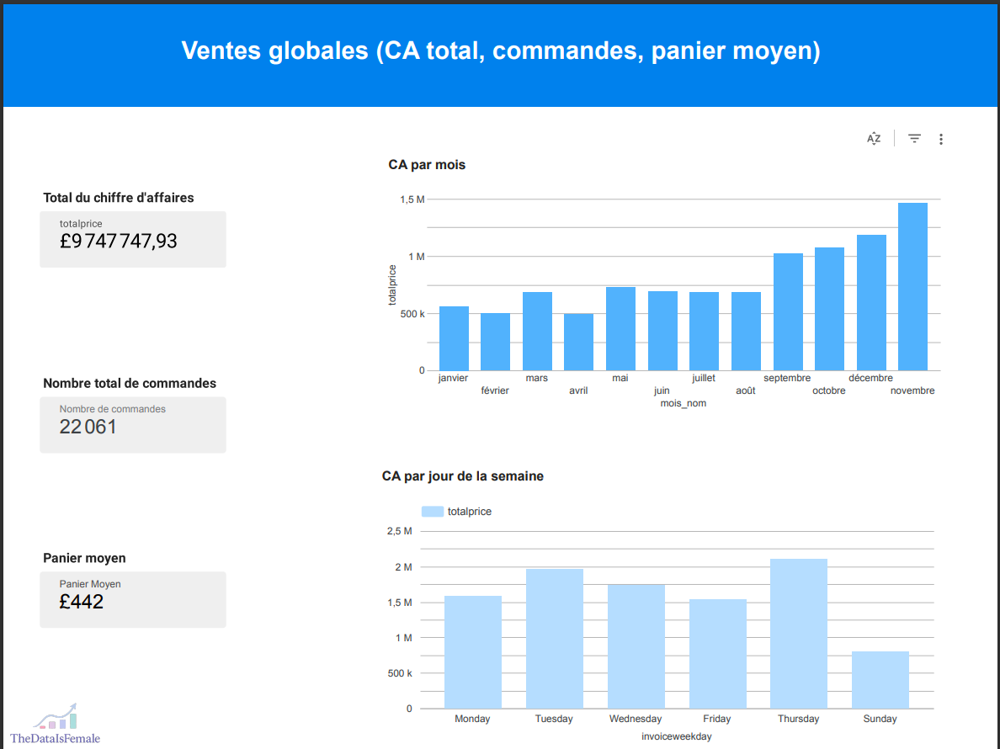
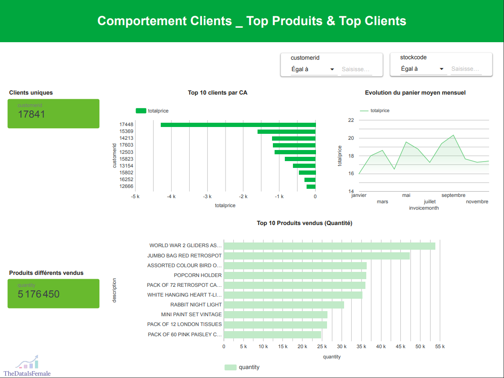
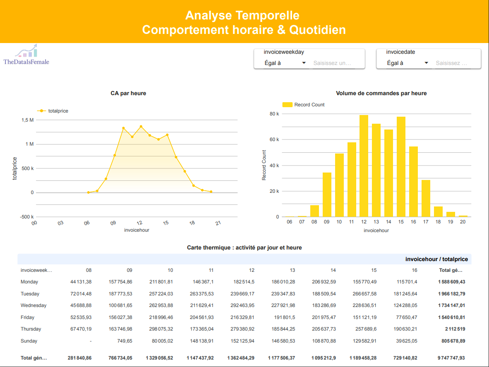
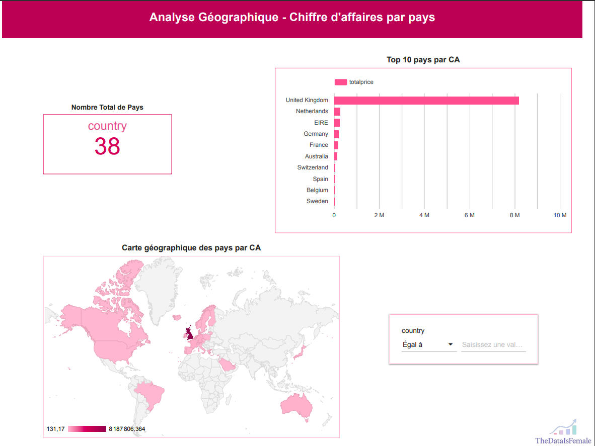

# E-commerce Dashboard – Looker Studio

**Analyse complète des ventes e-commerce** à travers 4 axes : **clients, produits, temps et géographie**.  
Projet réalisé avec **Python (Pandas, Matplotlib)** et **Google Looker Studio** pour la data visualisation.

---

## 🎯 Objectifs
- Comprendre les comportements d’achat
- Identifier les pics de vente par mois, jour, heure
- Visualiser les top clients / produits
- Analyser la répartition géographique du chiffre d’affaires

---

## 📊 Aperçu du Dashboard

| Page | Thème |
|------|-------|
| 1    | Vue globale : KPIs + CA par mois et jour |
| 2    | Comportement clients & top produits |
| 3    | Analyse temporelle horaire & journalière |
| 4    | Analyse géographique du CA par pays |

**Captures d’écran :**

### Page 1 - Ventes Globales
  

### Page 2 - Comportements Clients
  

### Page 3 - Analyse Temporelle
  

### Page 4 - Analyse Géographique

---
## Interprétation des résultats & Conclusion

Ce projet d’analyse e-commerce a permis de mettre en lumière plusieurs insights clés :

- **Les ventes sont les plus élevées en fin d’année**, notamment en novembre et décembre, confirmant l’impact des périodes de fêtes.
- **Le volume de commandes est le plus fort autour de 13h-15h**, avec un pic d’activité en milieu de semaine.
- **Le panier moyen est relativement stable** mais légèrement plus élevé les mardis et jeudis.
- **Quelques clients génèrent une grande part du CA**, révélant un effet 20/80 typique.
- **Les produits les plus vendus sont souvent des objets déco à bas prix**, suggérant une stratégie de volume plus que de marge.

Cette visualisation dynamique avec Google Looker Studio m’a permis de répondre à des questions précises sur les comportements d’achat, la saisonnalité et la segmentation client.  

Le projet démontre l’importance de **croiser les axes temps, produits, clients et géographie** pour une vue 360° du business.

---
## 📁 Données utilisées
- **Fichier source** : `data/online_retail_cleaned.csv`
- **Nettoyage & analyse** : dans le notebook `notebook/retail_analysis.ipynb`

---

## 🔗 Lien vers le Dashboard Looker Studio

👉 [Accéder au dashboard en ligne](https://lookerstudio.google.com/reporting/586a6293-2e2c-4d5c-b5b6-36252b2831c2)

---

## 👩‍💻 Auteur

**The Data Is Female**  
*Data Analyst Junior & Dashboard Designer*  
🔗 [Mon profil LinkedIn](https://www.linkedin.com/in/marieangeliquepied)

---

## 🛠️ Stack utilisée
- Python (Pandas, Matplotlib, Jupyter Notebook)
- Google Sheets
- Looker Studio
- Git & GitHub

---
## À propos
> Projet réalisé à des fins de portfolio.  
> Ce propos a été réalisé dans un cadre d'entraînement à la visualisation de données et structuration de projets analytiques. Il a pour but de simuler une **livraison professionnelle** à un client à travers un **dashboard clair, dynamique et interactif**.
